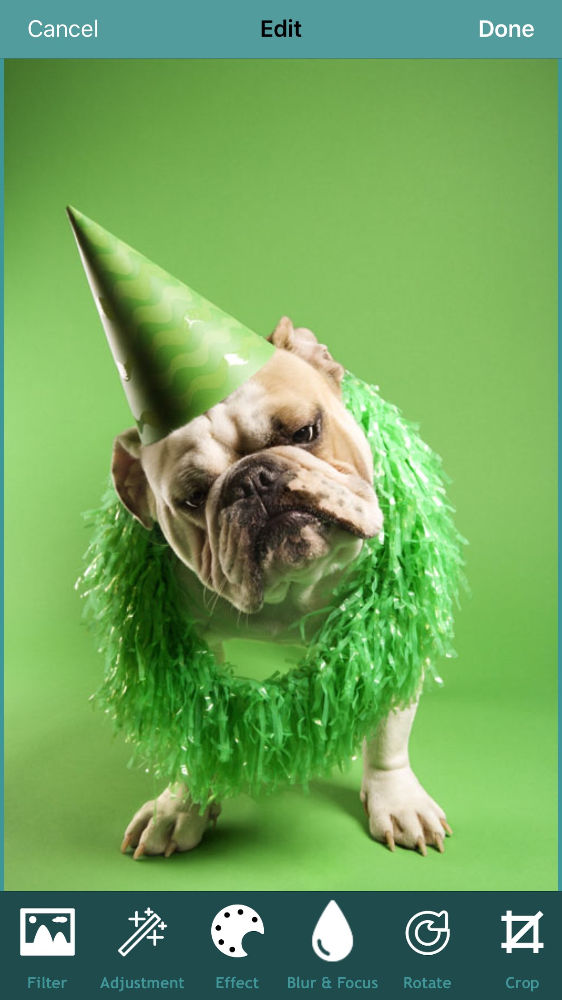
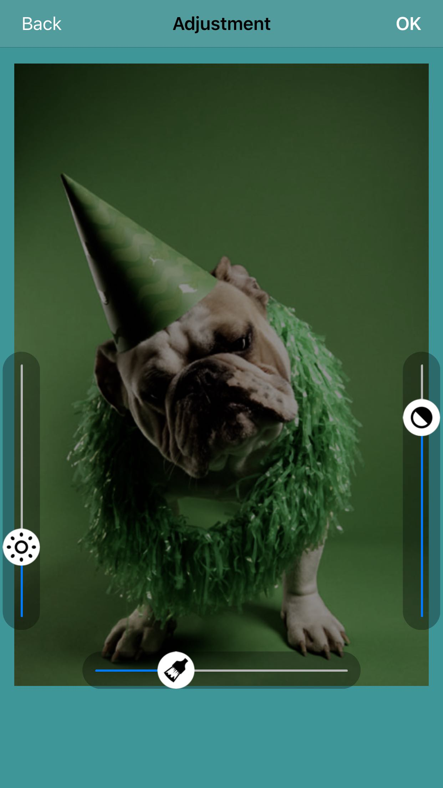
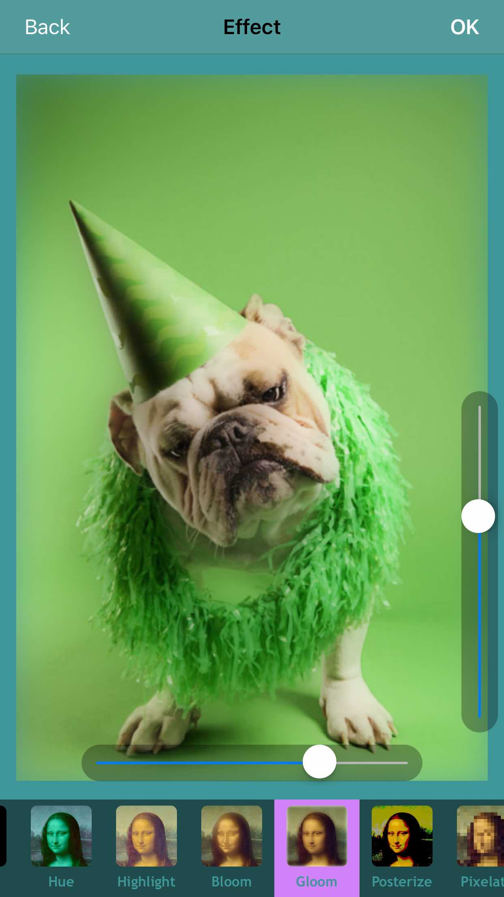
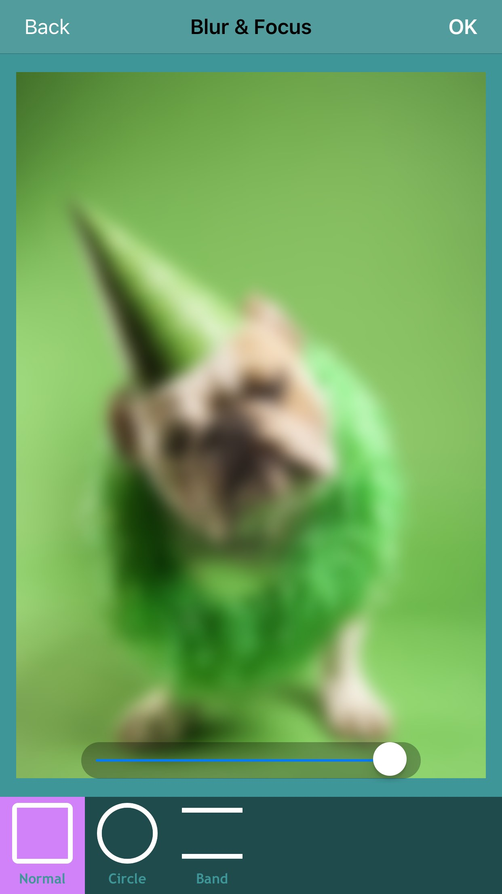
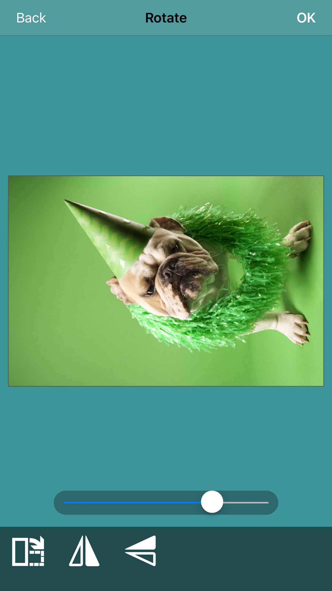
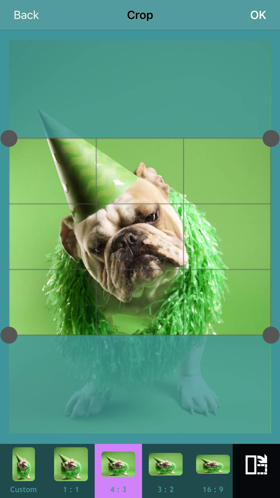
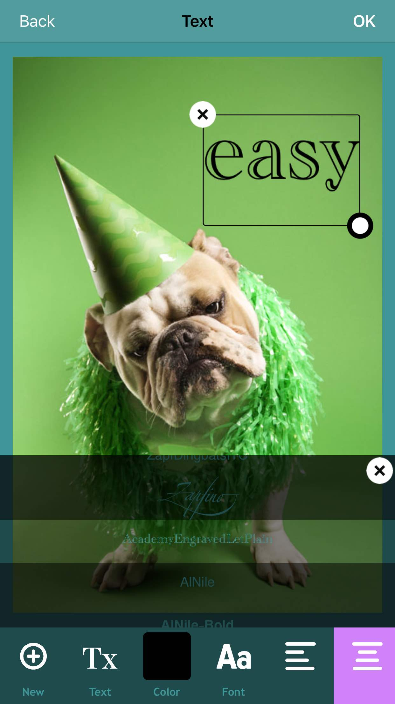
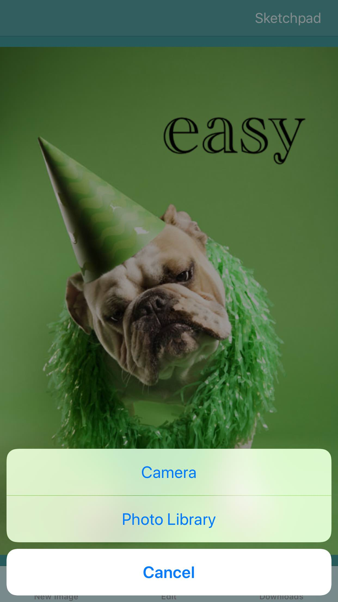

# Easy Picture Editing

- [English](/) 

  

[Easy Picture Editing] 应用程序是一个易于使用的图像编辑器，可以在几秒钟内增强您的照片。它还提供了一个简单的画布，以帮助您记录您的创作灵感。

# ◈ 主要特点： ◈

- 简单的素描画板
- 20个惊人的效果/过滤器
- 背景模糊效果将使您的照片更美丽，就像从数码单反相机拍摄
- 支持裁剪以及 旋转角度
- 支持添加文本
- 支持将照片分享至其他社交媒体网站、保存到照片库

# ◈ 欢迎评论和反馈◈

如果您发现缺少什么功能？或者发现了什么错误？欢迎告诉我们：
微信号: customer_service4app

# [更多技术支持，可以到这里联系我](https://ihtcboy.com)

## [https://ihtcboy.com](https://ihtcboy.com)

